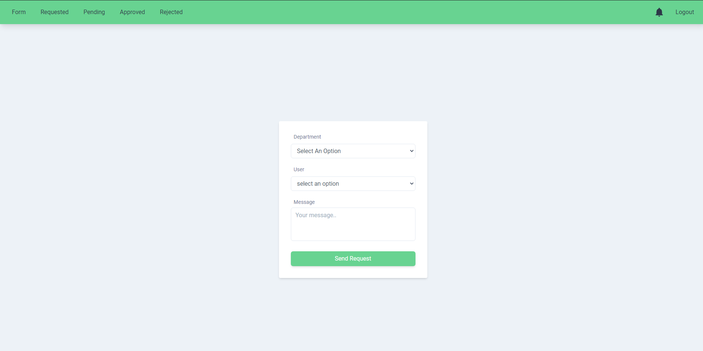

# Realtime Approval

## Client

url: https://realtime-approval-git-master.shekhar677.vercel.app

deployed on: https://vercel.com/

---

## Server

url: https://realtime-approval.herokuapp.com/

deployed on: https://www.heroku.com/

---

### commnad to deploy server to heroku (because server is in sub-directory and heroku deploys project from root directory)

> command: deploy to heroku: git subtree push --prefix server heroku master